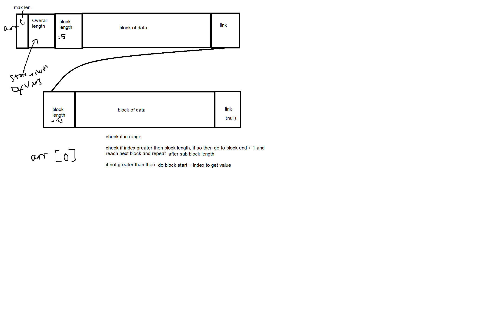
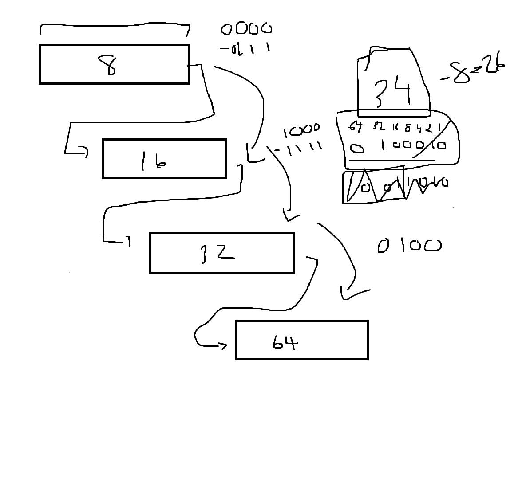

# Dynamic Link Array

## Description
This aims to reduce the cost of updating large arrays, i.e., copying the large number of elements to a larger
section of memory. It is very similar to a linked list in that some parts just point to the next section/index,
but it is not each section. When the array must grow, it just points to the next section. There is some metadata
at the start to keep track of data such as the size of the array overall. As well as the size of each section.

## Hopefully helpful images
### initial diagram 

### diagram 2 developed with [Owen](https://github.com/TheOddie)
